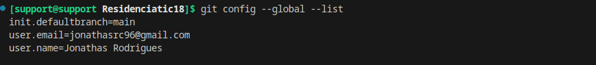
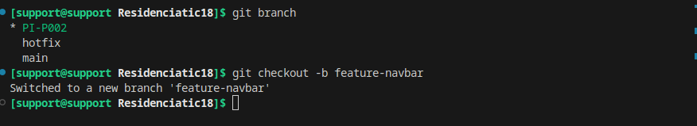
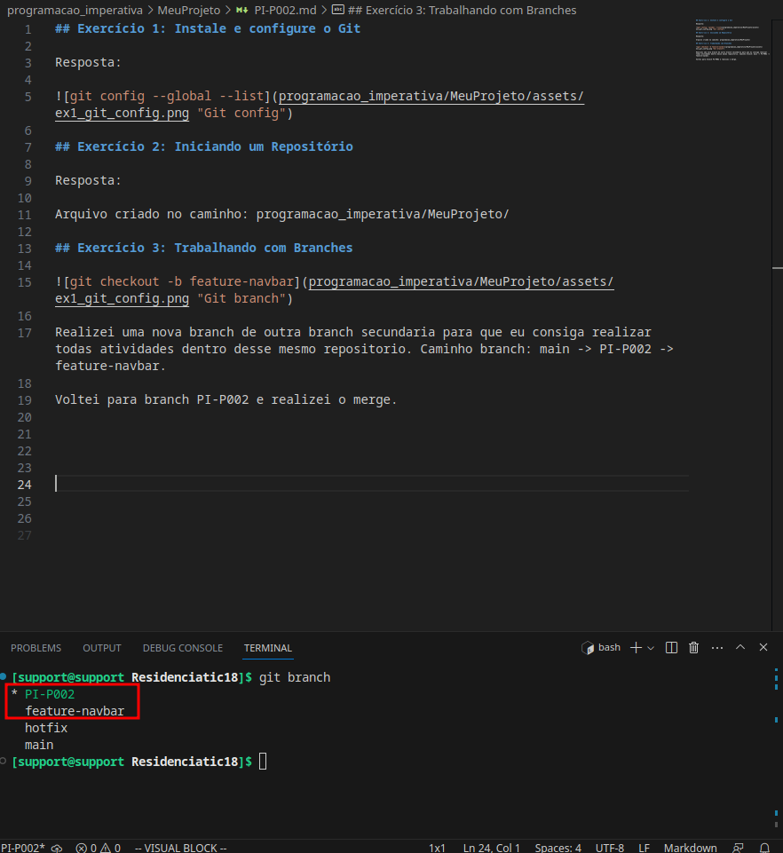
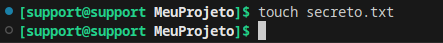
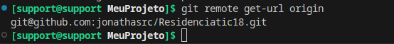
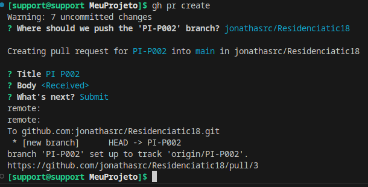
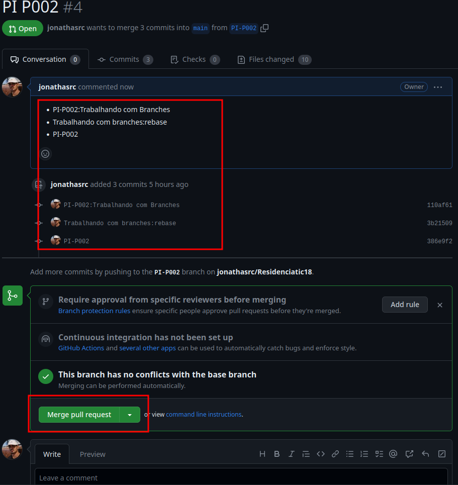

## Exercício 1: Instale e configure o Git

Resposta:

 

## Exercício 2: Iniciando um Repositório

Resposta:

Arquivo criado no caminho: programacao_imperativa/MeuProjeto/

## Exercício 3: Trabalhando com Branches

 

Realizei uma nova branch de outra branch secundaria para que eu consiga realizar todas atividades dentro desse mesmo repositorio. Caminho branch: main -> PI-P002 -> feature-navbar.

Voltei para branch PI-P002 e realizei o merge com estrategia rebase para não manter o historico de commits feito na branch feature-navbar.

 

## Exercício 5: Trabalhando com Repositórios Remotos

## Exercício 1: Instale e configure o Git

Resposta:

 

## Exercício 2: Iniciando um Repositório

Resposta:

Arquivo criado no caminho: programacao_imperativa/MeuProjeto/

## Exercício 3: Trabalhando com Branches

 

Realizei uma nova branch de outra branch secundaria para que eu consiga realizar todas atividades dentro desse mesmo repositorio. Caminho branch: main -> PI-P002 -> feature-navbar.

Voltei para branch PI-P002 e realizei o merge com estrategia rebase para não manter o historico de commits feito na branch feature-navbar.

 

## Exercício 4: Ignorando Arquivos

`$ git add .gitignore`

Inserindo o arquvio secreto.txt no .gitignore

## Exercício 5: Trabalhando com Repositórios Remotos

Inserir um repositorio remoto do github nomeado origin

##  Exercício 6: Clonando e Forking

1. Clonei meu proprio repositorio
2. Crie uma branch chamada PI-POO2
3. Alterei o arquivo intrdoucao.txt
4. `git push origin PI-P002`
5. Opitei criar pull request vi github cli

6. Aceitando o pull request no github

