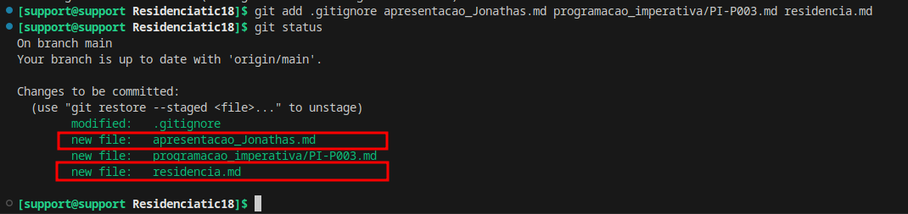
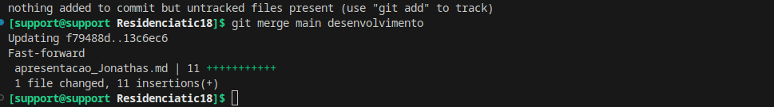

# Passo 1: Criação dos Arquivos Markdown

# Passo 2: Prática de Versionamento com Git

1. mkdir programacao_imperativa/maceio-git18
2. Sem grupo
3. Não se aplica
4. 
5. `git checkout -b desenvolvimento` 

# Passo 3: Edição e Conflitos

# Passo 4 : Resolução de conflitos

Resolvido

# Passo 5 : Fechamento da atividade

Resolvido